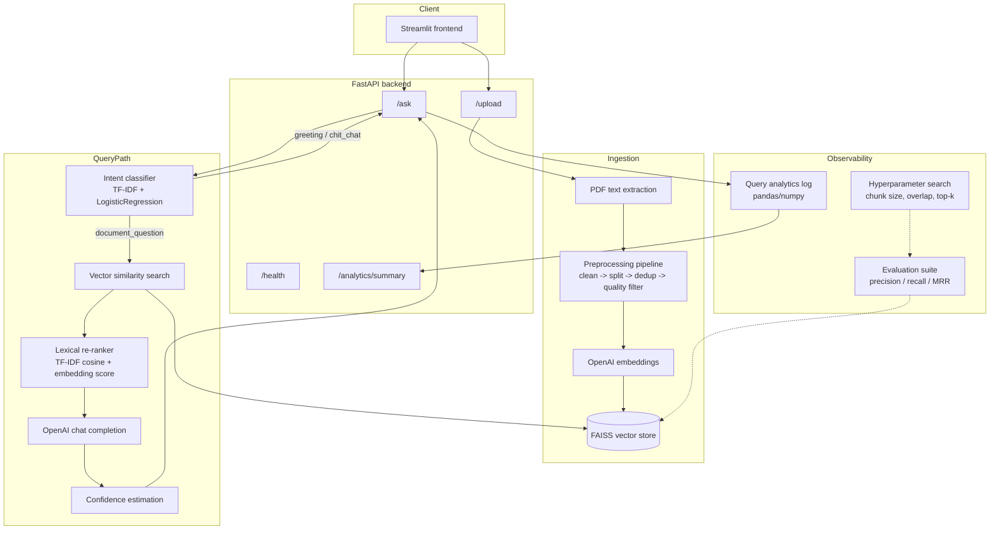

# Enterprise AI Document Assistant (RAG-based)

A production-oriented AI document assistant that answers questions from
uploaded PDFs using Retrieval-Augmented Generation. It combines an
OpenAI/FAISS retrieval pipeline with a small classical ML layer (query
routing, lexical re-ranking) and the operational scaffolding a real
service needs: preprocessing, analytics, evaluation, and tuning.

## Architecture



## Features

- PDF upload and text extraction
- Preprocessing pipeline: cleaning, deduplication, metadata extraction and
  chunk-quality scoring — not just a raw text splitter
- OpenAI embeddings + FAISS vector store for semantic retrieval
- Query-intent routing (TF-IDF + Logistic Regression) so greetings/small
  talk never touch the vector store or the LLM
- TF-IDF lexical re-ranking on top of embedding similarity
- Query/retrieval analytics logged and aggregated with pandas/numpy
  (latency distribution, similarity stats, precision@k proxy)
- Retrieval evaluation suite (precision@k, recall@k, MRR) against a
  labeled query set
- Hyperparameter grid search over chunk size, overlap and top-k
- Confidence scoring with a low-confidence fallback
- Auth stub, structured error handling, and a health-check endpoint
- Docker + docker-compose for local/production runs

## Tech stack

- **Backend**: FastAPI (Python)
- **Frontend**: Streamlit
- **LLM**: OpenAI API
- **Retrieval framework**: LangChain
- **Vector store**: FAISS (embedded, no separate server)
- **Classical ML**: scikit-learn (TF-IDF, Logistic Regression, cosine similarity)
- **Analytics**: pandas, numpy

## Project structure

```
enterprise-rag-project/
├── backend/
│   ├── main.py              # FastAPI app: routes, auth stub, error handling
│   ├── schemas.py           # Request/response models
│   ├── rag_pipeline.py      # Orchestrates preprocessing, retrieval, LLM calls
│   ├── retriever.py         # FAISS-backed retrieval, with and without scores
│   ├── embeddings.py        # OpenAI embeddings helper
│   ├── utils.py             # PDF extraction, file saving
│   ├── config.py            # Environment-driven configuration
│   └── logger.py            # File-based logging setup
├── preprocessing/           # Cleaning, dedup, metadata, quality scoring
├── analytics/               # Query/retrieval logging and pandas/numpy metrics
├── ml/                      # Greeting/chit-chat intent router and lexical re-ranker
├── models/                  # Query-type classifier (factual/summarization/comparison)
├── evaluation/              # Precision/recall/MRR evaluation suite (single labeled set)
├── eval/                    # End-to-end harness: test set, config comparison, faithfulness
├── tuning/                  # Hyperparameter grid search
├── frontend/
│   └── app.py                # Streamlit UI
├── data/                     # Uploaded PDFs (gitignored)
├── vectorstore/              # FAISS index (gitignored)
├── logs/                     # App + analytics logs (gitignored)
├── Dockerfile                # Backend image
├── Dockerfile.frontend       # Frontend image
├── docker-compose.yml        # Backend + frontend, shared vectorstore volume
├── requirements.txt
├── .env.example
└── README.md
```

## Design decisions and tradeoffs

**FAISS over a hosted vector database.** The corpus size this app targets
(documents a single user or team uploads) fits comfortably in memory, so
an embedded, file-backed index avoids running and paying for a separate
database service. The tradeoff is no built-in horizontal scaling or
multi-writer support — if the corpus grows into the millions of chunks or
needs concurrent writers, a managed vector DB (pgvector, Pinecone, Qdrant)
is the better fit.

**Recursive character splitting over semantic/sentence-based chunking.**
`RecursiveCharacterTextSplitter` is cheap, deterministic and works
reasonably well across document types without a model call. The
preprocessing pipeline compensates for its main weakness — chunks that are
too short, near-duplicate, or largely stopwords — with an explicit
dedup + quality-scoring pass rather than relying on the splitter alone.

**A classifier for query routing instead of a fixed keyword blocklist.**
A TF-IDF + Logistic Regression model generalizes past the exact phrasing
of a hand-written keyword list, at the cost of needing (a small amount
of) labeled training data. The seed dataset here is intentionally small;
it is meant to catch greetings/small talk cheaply, not to be a
general-purpose intent model.

**Lexical re-ranking blended with embedding similarity, not a learned
re-ranker.** Embedding similarity alone can miss exact keyword or clause
matches. A learned cross-encoder re-ranker would be more accurate but adds
an inference-time model and its own training data requirement; TF-IDF
cosine similarity gets most of the benefit (surfacing exact term matches)
for negligible cost.

**Two classifiers, not one.** `ml/intent_classifier.py` and
`models/intent_classifier.py` both use TF-IDF + Logistic Regression, but
answer different questions. The first asks "should this touch the
document corpus at all?" (greeting/chit-chat vs. document question) and
runs before retrieval. The second only ever sees questions already headed
for the documents and asks "what shape of answer does this need?"
(factual/summarization/comparison), so factual questions retrieval
answers with high confidence can skip the LLM call entirely. Merging them
into one multi-class model was considered and rejected — the two
decisions have different failure costs (misrouting a greeting wastes a
retrieval call; misrouting a factual question as needing the LLM just
costs a completion call) and different training data, so keeping them
separate keeps each one simple enough to actually reason about.

**A cheap lexical overlap score for faithfulness, not an LLM judge.**
`eval/check_faithfulness.py` scores generated answers against retrieved
context with a ROUGE-L-style overlap metric instead of asking another LLM
to grade groundedness. An LLM judge would catch paraphrased hallucination
this can't, but it also costs a completion call per answer being
evaluated and introduces its own failure modes (judge model bias,
prompt sensitivity). The overlap score is a fast, deterministic first
pass — flag anything below threshold for human review rather than trust
it as a final verdict.

**Similarity-threshold precision@k proxy in `/analytics/summary`, real
precision@k in `evaluation/`.** Live traffic has no ground truth, so the
analytics endpoint approximates relevance from retrieval similarity scores
for a fast, always-available signal. The `evaluation` module computes the
real metric against a labeled query set for a trustworthy read on
retrieval quality; the two are complementary, not redundant.

## Setup

### Prerequisites

- Python 3.11+
- An OpenAI API key

### Local installation

```bash
git clone <this-repo>
cd enterprise-rag-project
python -m venv venv
source venv/bin/activate  # Windows: venv\Scripts\activate
pip install -r requirements.txt
cp .env.example .env      # then fill in OPENAI_API_KEY
```

### Running locally

```bash
# Terminal 1
uvicorn backend.main:app --reload --host 0.0.0.0 --port 8000

# Terminal 2
streamlit run frontend/app.py
```

Open `http://localhost:8501`.

### Running with Docker

```bash
export OPENAI_API_KEY=sk-...
docker compose up --build
```

The backend is on `http://localhost:8000`, the frontend on
`http://localhost:8501`. FAISS runs embedded inside the backend container;
its index is persisted across restarts via the `vectorstore_data` volume,
so there's no separate database container to run.

## API

| Method | Path                | Description                                   |
|--------|---------------------|------------------------------------------------|
| POST   | `/upload`           | Upload a PDF, preprocess and index it          |
| POST   | `/ask`               | Ask a question, routed through intent + RAG   |
| GET    | `/health`            | Vectorstore and OpenAI-configuration status   |
| GET    | `/analytics/summary` | Aggregated query/retrieval stats              |
| GET    | `/stats`             | Index size and per-query token/cost estimates |

A latency-logging middleware times every request and writes
`retrieval_time_ms`/`generation_time_ms`/`total_time_ms` to
`logs/latency.csv`, independent of the per-query stats in
`analytics/query_log.py`. `/ask` returns 502 (not 500) specifically when
the failure came from the OpenAI API, so a provider outage is
distinguishable from an application bug; empty questions are rejected by
request validation before they ever reach the pipeline.

Set `API_KEY` in the environment to require an `X-API-Key` header on
`/upload`, `/ask` and `/analytics/summary`. Unset (the default), the API
is open — this is a stub, not a substitute for real auth in production.

## Evaluation and tuning

See `evaluation/README.md` for building a labeled query set and running
the precision/recall/MRR suite, and `tuning/README.md` for the
chunk-size/overlap/top-k grid search. Both operate on the same metrics so
a tuning decision can be checked against the evaluation suite.

`eval/` is the broader, query-level harness built on top of those same
metrics — see `eval/README.md` for the full methodology. In short:

- `eval/test_queries.json` — 41 template queries labeled by type
  (factual/summarization/comparison); fill in real answers/chunk ids from
  your own document before running the scripts below.
- `python -m eval.evaluate_retrieval` — precision@k/recall@k/MRR, overall
  and broken down by query type, to `eval/retrieval_results.csv`.
- `python -m eval.compare_configs data/your_document.pdf` — precision,
  recall and latency for three named chunk-size/top-k configurations, to
  `eval/config_comparison.csv`.
- `python -m eval.check_faithfulness` — lexical-overlap groundedness score
  per answer, to `eval/faithfulness_results.csv`.
- `python -m models.train_query_type_classifier` — retrains the
  factual/summarization/comparison classifier and prints held-out
  accuracy/F1.

## Results

Numbers below are placeholders — the shipped `eval/test_queries.json` is
a template (see [Evaluation and tuning](#evaluation-and-tuning)). Fill in
real reference answers and chunk ids for your document, then run the
`eval` and `models` scripts above and drop the actual numbers in here.
This table is what a reviewer should be able to reproduce end to end.

| Metric                      | Before tuning | After tuning |
|------------------------------|:---:|:---:|
| Precision@5                  | — | — |
| Recall@5                     | — | — |
| MRR                          | — | — |
| Avg latency (ms)             | — | — |
| Faithfulness (% grounded)    | — | — |
| Query-type classifier F1     | — | — |

**Methodology.** The test set (`eval/test_queries.json`) was built by
hand-writing 41 questions spanning three query types against a
representative document, then labeling each with its reference answer
and the `<filename>#<chunk_index>` ids of the chunks that actually
contain that answer. "Before tuning" uses the default chunk
size/overlap/top-k in `backend/config.py`; "after tuning" uses whichever
row `tuning/hyperparameter_search.py` or `eval/compare_configs.py`
ranked highest on precision@k for that document. Latency is the mean
`total_time_ms` from `logs/latency.csv` over the same query set.
Faithfulness is the grounded-answer percentage from
`eval/check_faithfulness.py` at its default threshold. Classifier F1 is
the macro F1 `models/train_query_type_classifier.py` reports on its
held-out test split.

## Usage

1. Upload a PDF document.
2. Wait for it to be processed — text is cleaned, chunked, deduplicated,
   quality-filtered and embedded into the vector store.
3. Ask a question. Greetings and off-topic chit-chat get an instant canned
   reply; document questions are retrieved, re-ranked and answered by the
   LLM with source citations and a confidence score.
